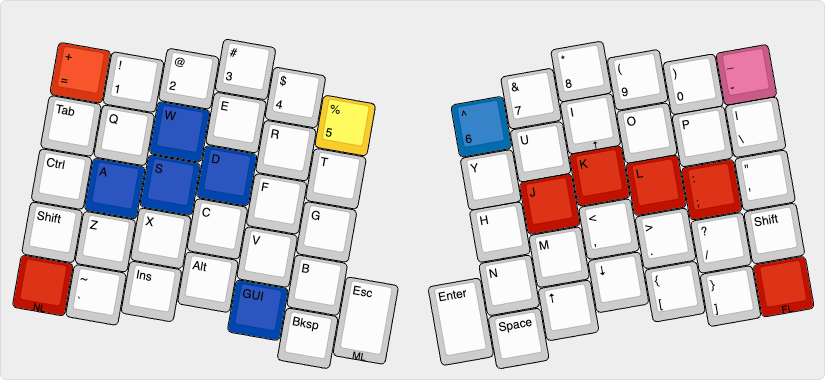
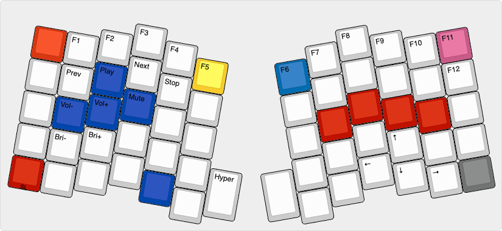
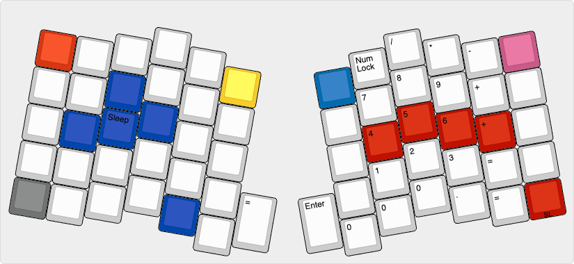
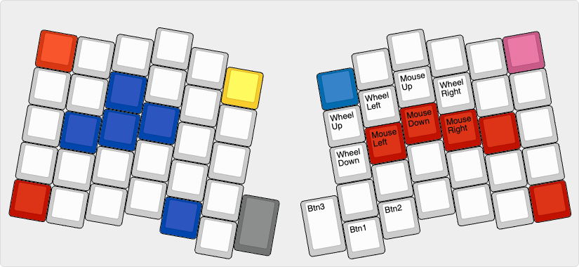
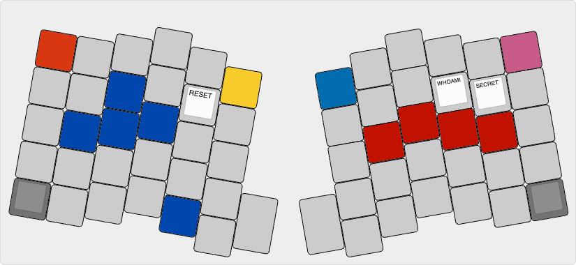

# Atreus

A 62 key variant of the Atreus keyboard.

https://github.com/profet23/atreus62

Keyboard Maintainer: QMK Community  
Hardware Supported: Atreus62 PCB  
Hardware Availability: http://shop.profetkeyboards.com/product/atreus62-keyboard

Make example for this keyboard (after setting up your build environment):

    make atreus62:default

See [build environment setup](https://docs.qmk.fm/#/getting_started_build_tools) then the [make instructions](https://docs.qmk.fm/#/getting_started_make_guide) for more information.

# Steps to building this keyboard
Create a new default mapping and file so qmk `compile` and `flash` work
```
qmk new-keymap -kb atreus62
~/qmk_firmware/keyboards/atreus62/keymaps/stephenluc/keymap.c
```

Copy and adjust keyboard then compile and flash
```
qmk compile -kb atreus62 -km stephenluc
qmk flash -kb atreus62 -km stephenluc
```

# Latest Layout
**Base Layer**


**Function Layer**


**Number Layer**


**Mouse Layer**


**System Layer**

